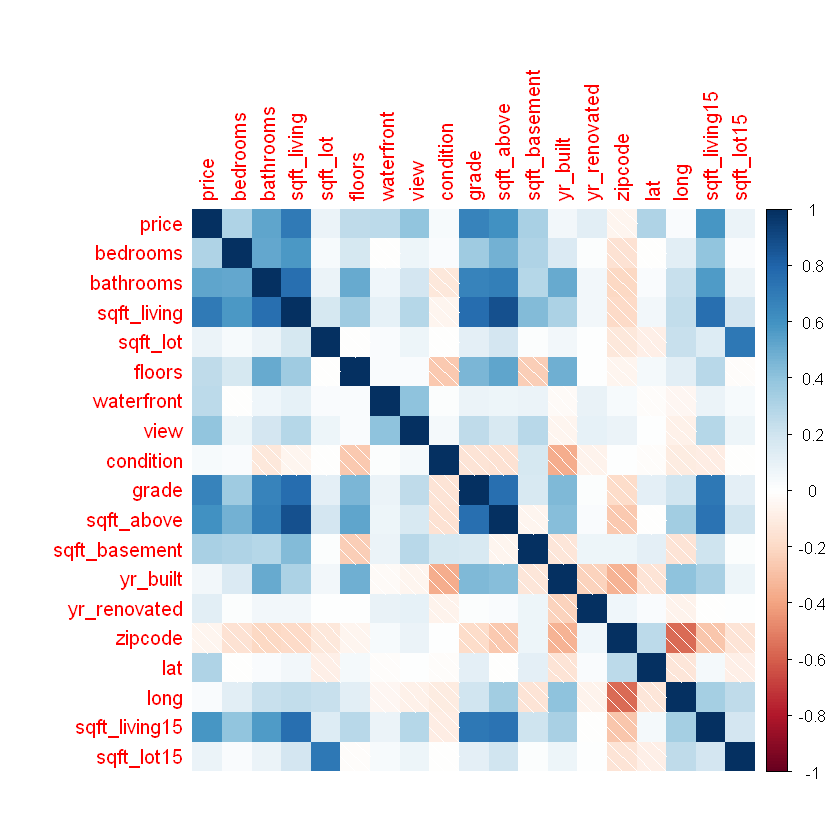
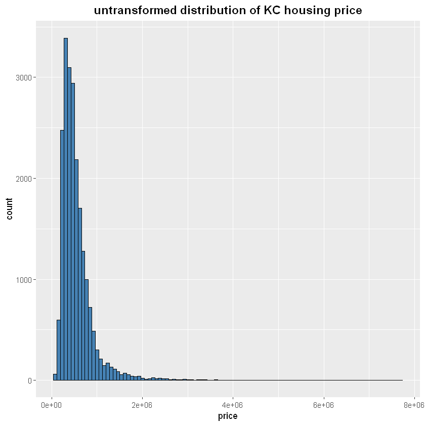
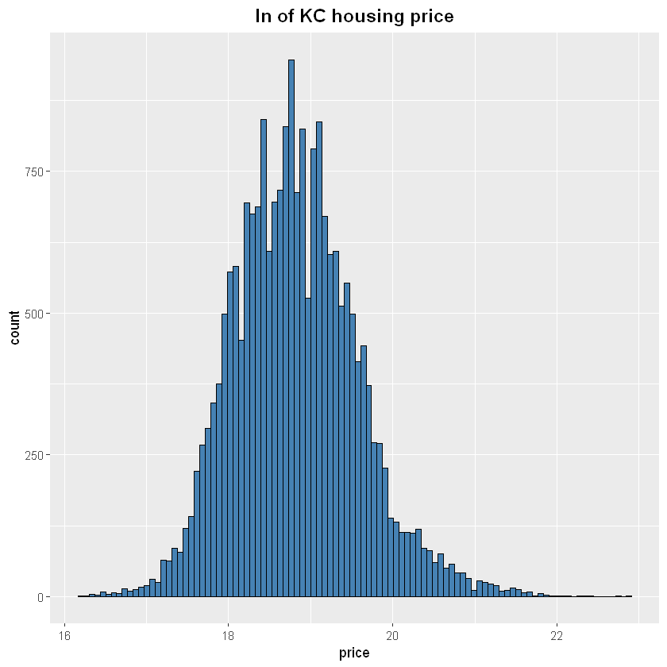
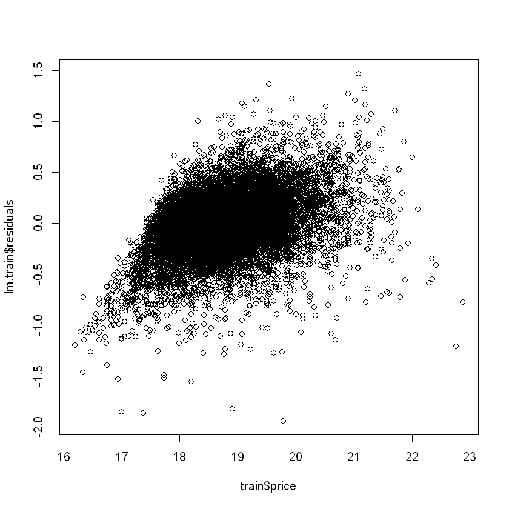
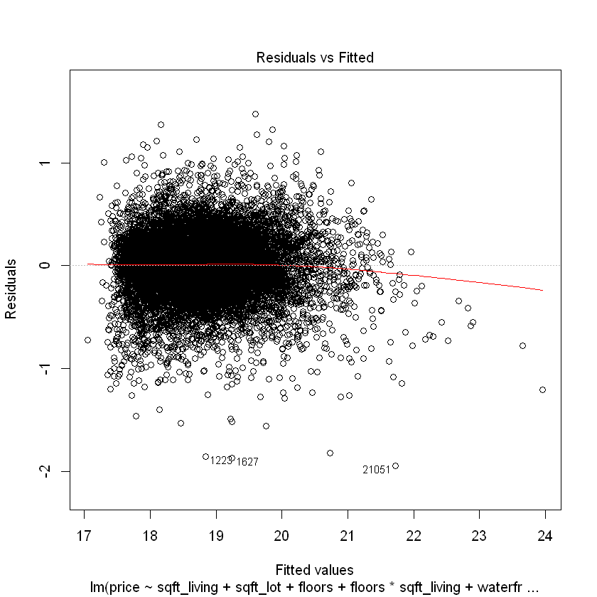
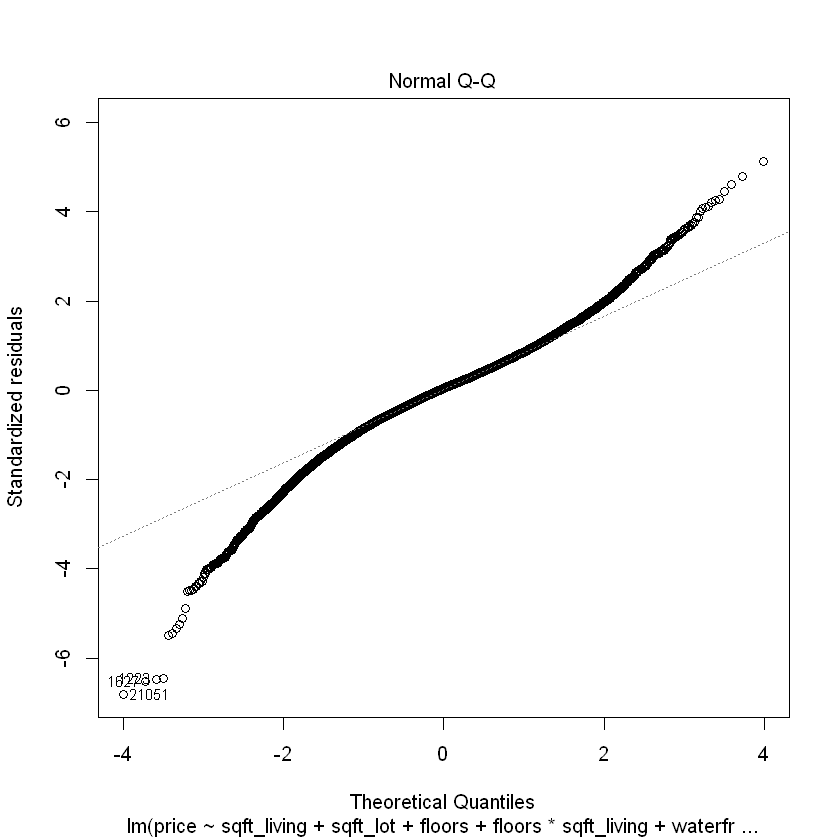
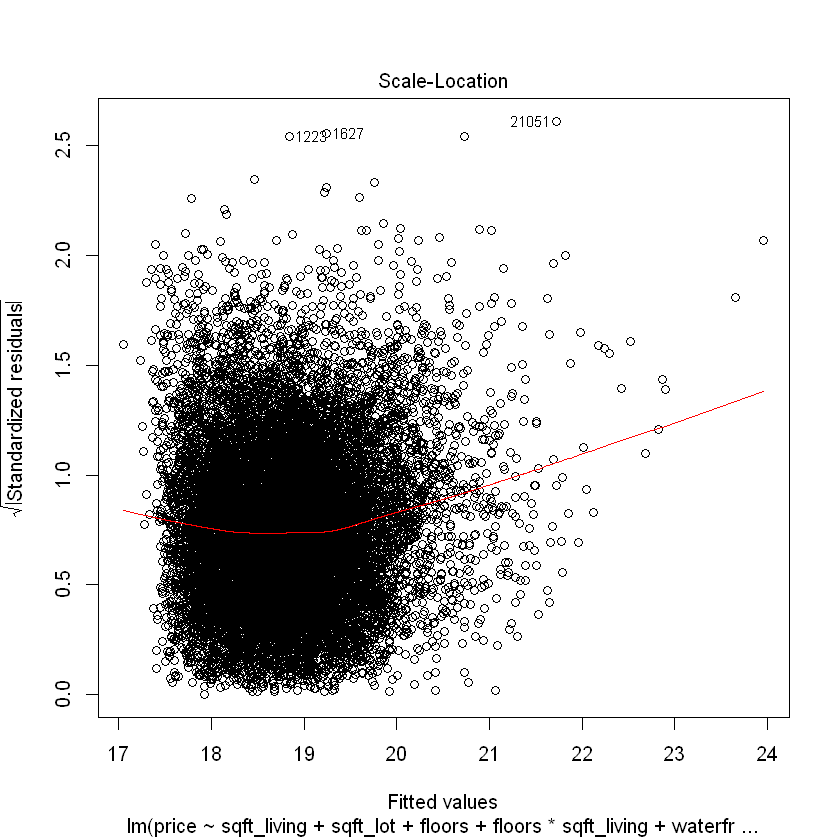
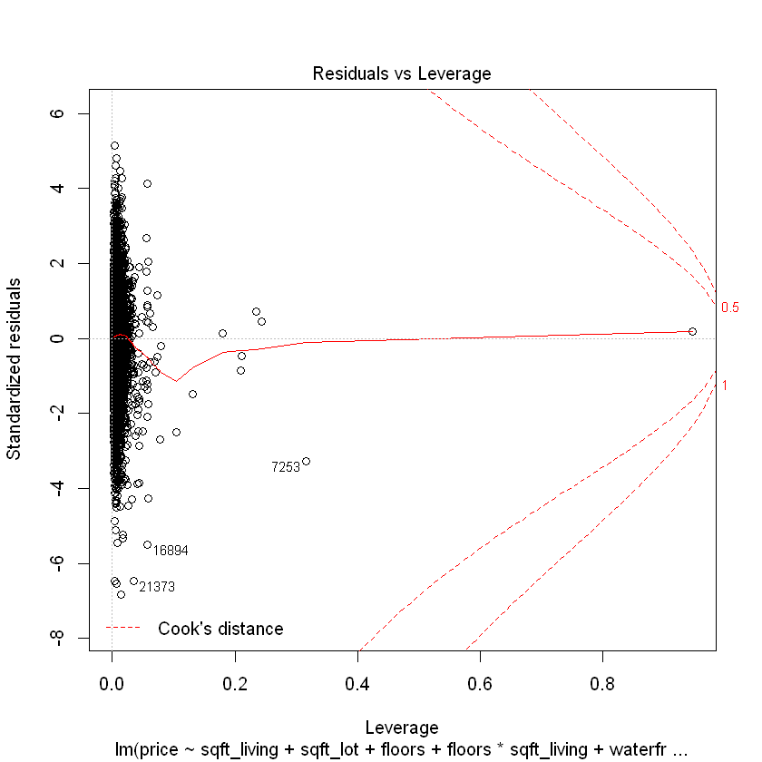
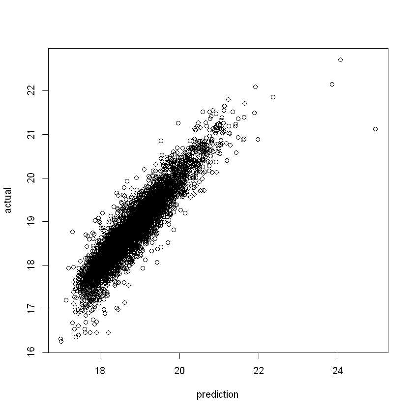

<font size="4" face="Georgia" color="#000000"><b>
This notebook demonstrates multiple regression techniques in R using the 'House Sales in King County, Washington' dataset. 

The dataset can be found here: <a href="https://www.kaggle.com/harlfoxem/housesalesprediction" target="_blank">https://www.kaggle.com/harlfoxem/housesalesprediction</a></b> </font>

<font size="4" face="Georgia" color="#000000">
First, I will install the necessary packages for analysing my regression model. 
<ul>
  <li>car - Companion to Applied Regression</li>
  <li>corrplot - https://cran.r-project.org/web/packages/corrplot/vignettes/corrplot-intro.html </li>
  <li>MASS - https://www.rdocumentation.org/packages/MASS/versions/7.3-51.5 </li>
  <li>ggplot2- https://ggplot2.tidyverse.org/ </li>
</ul>
    </font>


```R
#install.packages("car")
library(car)
#install.packages("corrplot")
library(corrplot)
#install.packages("MASS")
library(MASS)
#install.packages("ggplot2")
library(ggplot2)

```


```R
kc.house = read.csv("kc_house_data.csv") # Read in the dataset from a .csv.
df <- data.frame(kc.house) # Put the data into a data frame.
```


```R
summary(df) # View a 5 number summary the dataset. 
```


           id                         date           price            bedrooms     
     Min.   :1.000e+06   20140623T000000:  142   Min.   :  75000   Min.   : 0.000  
     1st Qu.:2.123e+09   20140625T000000:  131   1st Qu.: 321950   1st Qu.: 3.000  
     Median :3.905e+09   20140626T000000:  131   Median : 450000   Median : 3.000  
     Mean   :4.580e+09   20140708T000000:  127   Mean   : 540088   Mean   : 3.371  
     3rd Qu.:7.309e+09   20150427T000000:  126   3rd Qu.: 645000   3rd Qu.: 4.000  
     Max.   :9.900e+09   20150325T000000:  123   Max.   :7700000   Max.   :33.000  
                         (Other)        :20833                                     
       bathrooms      sqft_living       sqft_lot           floors     
     Min.   :0.000   Min.   :  290   Min.   :    520   Min.   :1.000  
     1st Qu.:1.750   1st Qu.: 1427   1st Qu.:   5040   1st Qu.:1.000  
     Median :2.250   Median : 1910   Median :   7618   Median :1.500  
     Mean   :2.115   Mean   : 2080   Mean   :  15107   Mean   :1.494  
     3rd Qu.:2.500   3rd Qu.: 2550   3rd Qu.:  10688   3rd Qu.:2.000  
     Max.   :8.000   Max.   :13540   Max.   :1651359   Max.   :3.500  
                                                                      
       waterfront            view          condition         grade       
     Min.   :0.000000   Min.   :0.0000   Min.   :1.000   Min.   : 1.000  
     1st Qu.:0.000000   1st Qu.:0.0000   1st Qu.:3.000   1st Qu.: 7.000  
     Median :0.000000   Median :0.0000   Median :3.000   Median : 7.000  
     Mean   :0.007542   Mean   :0.2343   Mean   :3.409   Mean   : 7.657  
     3rd Qu.:0.000000   3rd Qu.:0.0000   3rd Qu.:4.000   3rd Qu.: 8.000  
     Max.   :1.000000   Max.   :4.0000   Max.   :5.000   Max.   :13.000  
                                                                         
       sqft_above   sqft_basement       yr_built     yr_renovated   
     Min.   : 290   Min.   :   0.0   Min.   :1900   Min.   :   0.0  
     1st Qu.:1190   1st Qu.:   0.0   1st Qu.:1951   1st Qu.:   0.0  
     Median :1560   Median :   0.0   Median :1975   Median :   0.0  
     Mean   :1788   Mean   : 291.5   Mean   :1971   Mean   :  84.4  
     3rd Qu.:2210   3rd Qu.: 560.0   3rd Qu.:1997   3rd Qu.:   0.0  
     Max.   :9410   Max.   :4820.0   Max.   :2015   Max.   :2015.0  
                                                                    
        zipcode           lat             long        sqft_living15 
     Min.   :98001   Min.   :47.16   Min.   :-122.5   Min.   : 399  
     1st Qu.:98033   1st Qu.:47.47   1st Qu.:-122.3   1st Qu.:1490  
     Median :98065   Median :47.57   Median :-122.2   Median :1840  
     Mean   :98078   Mean   :47.56   Mean   :-122.2   Mean   :1987  
     3rd Qu.:98118   3rd Qu.:47.68   3rd Qu.:-122.1   3rd Qu.:2360  
     Max.   :98199   Max.   :47.78   Max.   :-121.3   Max.   :6210  
                                                                    
       sqft_lot15    
     Min.   :   651  
     1st Qu.:  5100  
     Median :  7620  
     Mean   : 12768  
     3rd Qu.: 10083  
     Max.   :871200  
                     


<font size="4" face="Georgia" color="#000000">
From the 5-number summary above I see that the 'date' field needs to be transformed into a data type usable by R.</font>


```R
df$date <- substr(df$date,1 ,8) # Remove the time part of the time stamp because it is blank.

# Next, convert the date col into a data type (POSIXct) usable by R Libraries. 
df$date = strptime(df$date, format="%Y%m%d")
df$date = as.POSIXct(df$date)
```


```R
df$date[1] # Display the newly formmated data column. 
```


    [1] "2014-10-13 CDT"


```R
df <- df[rowSums(is.na(df)) == 0,] # Clean out any null rows in the data frame.
key <- df[,1] # Save 1st column which the primary key to a new vector in case its needed later. 
df <- df[-c(1)] # Drop the primary key from dataframe for analysis. 
```


```R
df.numeric <- df[,-1] # Create dataframe with only numeric values. This is necessary because to make a correlation plot
# you need only numeric values.

corrplot(cor(df.numeric), method = "shade") # Make a corraltion plot. 
```





<font size="4" face="Georgia" color="#000000">
From this correlation plot I can see that the 'sqft_above' column has perfect multicollinearity with 'sqrt living'. This is bad because it can cause wrong Beta coefficient values or change the sign of our beta coefficients.</font> 


```R
df <- df[,-c(12)] # drop the 'sqft_above' col because it has a correlation value of 1 with 'sqrt_living'.
```

<font size="4" face="Georgia" color="#000000">
In this step I will check for multicollinearity among my predictors using VIF scores. VIF = 1 / (1 - R^2(xi).

Where R^2(xi) is equal to the R^2 value when xi is predicted using all the other predictors. 

A VIF value is considered bad if it is 10 or above. There shouldn't be any high VIF values because I removed the most obvious one above via the correlation plot above, but VIF is another check on that.
</font>


```R
df.check.multi.co <- lm(formula = price ~ . ,data = df) # Function call to create a regression model with all 
# predictors. This is necessary to check VIF scores. 

round(vif(df.check.multi.co),2) 
```


<dl class=dl-horizontal>
	<dt>date</dt>
		<dd>1.01</dd>
	<dt>bedrooms</dt>
		<dd>1.65</dd>
	<dt>bathrooms</dt>
		<dd>3.35</dd>
	<dt>sqft_living</dt>
		<dd>6.06</dd>
	<dt>sqft_lot</dt>
		<dd>2.1</dd>
	<dt>floors</dt>
		<dd>2.01</dd>
	<dt>waterfront</dt>
		<dd>1.2</dd>
	<dt>view</dt>
		<dd>1.44</dd>
	<dt>condition</dt>
		<dd>1.25</dd>
	<dt>grade</dt>
		<dd>3.42</dd>
	<dt>sqft_basement</dt>
		<dd>1.99</dd>
	<dt>yr_built</dt>
		<dd>2.43</dd>
	<dt>yr_renovated</dt>
		<dd>1.15</dd>
	<dt>zipcode</dt>
		<dd>1.66</dd>
	<dt>lat</dt>
		<dd>1.18</dd>
	<dt>long</dt>
		<dd>1.83</dd>
	<dt>sqft_living15</dt>
		<dd>2.98</dd>
	<dt>sqft_lot15</dt>
		<dd>2.14</dd>
</dl>


<font size="4" face="Georgia" color="#000000">Next, I need to convert all the columns that need to be coded into dummy variables into factors. </font>


```R
df$bedrooms <- as.factor(df$bedrooms)
df$bathrooms <- as.factor(df$bathrooms)
df$floors <- as.factor(df$floors)
df$view <- as.factor(df$view)
df$waterfront <- as.factor(df$waterfront)
df$condition <- as.factor(df$condition)
df$grade <- as.factor(df$grade)
df$yr_built <- as.factor(df$yr_built)
df$yr_renovated <- as.factor(df$yr_renovated)
df$zipcode <- as.factor(df$zipcode)
```

<font size="4" face="Georgia" color="#000000">Next, I will transform my dependent variable by taking the natural log of it. I do this because price is a monetary variable. Monetary variables typical exhibit multiplicative errors and almost always need to be transformed. </font>


```R
ggplot(df, aes(x=price)) + geom_histogram(bins=100, color="black", fill="steelblue") + 
ggtitle("untransformed distribution of KC housing price") + 
  theme(plot.title = element_text(color="black", size=14, face="bold", hjust=".5"))
```





```R
df$price <- log2(df$price) # take the natrual log on price.
```


```R
ggplot(df, aes(x=price)) + geom_histogram(bins=100, color="black", fill="steelblue") + 
ggtitle("ln of KC housing price") + 
  theme(plot.title = element_text(color="black", size=14, face="bold", hjust=".5"))
```





<font size="4" face="Georgia" color="#000000"> Now, I will create training and test dataset for cross-validation.  </font>


```R
set.seed(123)
# Here I chose a simple 70% 30% dataset split to prevent overfitting. My regression model will be trained on 70% of the
# dataset and the other 30% of the data will be used to validate the model at the end.

partition <- sample(2, nrow(df), replace=TRUE, prob = c(0.70, 0.30))   
train <- df[partition==1 ,] 
test <- df[partition==2 ,]
```

<font size="4" face="Georgia" color="#000000">My first attempt at a regression model will have all predictors, no interaction terms and no higer order terms. </font>


```R
lm.train <- lm(formula = price ~ . ,data = train)
summary(lm.train)
```


    
    Call:
    lm(formula = price ~ ., data = train)
    
    Residuals:
         Min       1Q   Median       3Q      Max 
    -1.84433 -0.13674  0.00634  0.14322  1.48035 
    
    Coefficients:
                       Estimate Std. Error t value Pr(>|t|)    
    (Intercept)      -9.195e+01  1.192e+01  -7.715 1.29e-14 ***
    date              3.644e-09  2.152e-10  16.930  < 2e-16 ***
    bedrooms1        -4.409e-02  1.055e-01  -0.418 0.675896    
    bedrooms2        -2.229e-02  1.044e-01  -0.213 0.830943    
    bedrooms3         2.272e-02  1.043e-01   0.218 0.827585    
    bedrooms4         2.019e-02  1.044e-01   0.193 0.846691    
    bedrooms5        -2.257e-02  1.047e-01  -0.216 0.829347    
    bedrooms6        -4.463e-02  1.062e-01  -0.420 0.674298    
    bedrooms7        -1.426e-01  1.163e-01  -1.226 0.220312    
    bedrooms8        -1.328e-01  1.394e-01  -0.953 0.340634    
    bedrooms9        -9.360e-02  1.687e-01  -0.555 0.578949    
    bedrooms10       -6.427e-02  2.775e-01  -0.232 0.816829    
    bedrooms11        1.096e-01  2.882e-01   0.380 0.703729    
    bedrooms33        2.184e-01  2.773e-01   0.788 0.430788    
    bathrooms0.5     -4.665e-01  2.206e-01  -2.114 0.034521 *  
    bathrooms0.75     4.086e-02  1.289e-01   0.317 0.751297    
    bathrooms1        3.352e-02  1.248e-01   0.269 0.788225    
    bathrooms1.25     5.351e-02  1.628e-01   0.329 0.742345    
    bathrooms1.5      5.896e-02  1.249e-01   0.472 0.636939    
    bathrooms1.75     1.129e-01  1.248e-01   0.905 0.365652    
    bathrooms2        1.041e-01  1.249e-01   0.833 0.404684    
    bathrooms2.25     1.630e-01  1.250e-01   1.305 0.192019    
    bathrooms2.5      1.560e-01  1.249e-01   1.250 0.211454    
    bathrooms2.75     1.657e-01  1.251e-01   1.324 0.185525    
    bathrooms3        1.775e-01  1.254e-01   1.416 0.156894    
    bathrooms3.25     1.780e-01  1.256e-01   1.417 0.156377    
    bathrooms3.5      1.689e-01  1.255e-01   1.346 0.178423    
    bathrooms3.75     1.790e-01  1.275e-01   1.404 0.160199    
    bathrooms4        1.512e-01  1.276e-01   1.185 0.235869    
    bathrooms4.25     1.858e-01  1.296e-01   1.433 0.151904    
    bathrooms4.5      1.465e-01  1.291e-01   1.134 0.256606    
    bathrooms4.75     1.048e-01  1.462e-01   0.717 0.473576    
    bathrooms5        1.468e-01  1.464e-01   1.002 0.316119    
    bathrooms5.25     1.533e-01  1.500e-01   1.022 0.306813    
    bathrooms5.5      4.707e-02  1.567e-01   0.300 0.763944    
    bathrooms5.75    -2.399e-02  2.326e-01  -0.103 0.917838    
    bathrooms6       -1.167e-01  1.740e-01  -0.671 0.502408    
    bathrooms6.25     6.563e-02  2.287e-01   0.287 0.774134    
    bathrooms6.5      3.904e-01  2.891e-01   1.350 0.176910    
    bathrooms6.75    -5.778e-01  2.916e-01  -1.981 0.047593 *  
    bathrooms7.5     -4.380e-01  3.151e-01  -1.390 0.164563    
    bathrooms8       -3.084e-01  3.206e-01  -0.962 0.336100    
    sqft_living       3.083e-04  6.304e-06  48.904  < 2e-16 ***
    sqft_lot          1.020e-06  7.754e-08  13.150  < 2e-16 ***
    floors1.5        -1.592e-02  9.157e-03  -1.738 0.082186 .  
    floors2          -8.320e-02  7.990e-03 -10.414  < 2e-16 ***
    floors2.5        -1.005e-01  2.547e-02  -3.947 7.96e-05 ***
    floors3          -2.097e-01  1.655e-02 -12.676  < 2e-16 ***
    floors3.5        -1.115e-01  1.081e-01  -1.031 0.302345    
    waterfront1       6.380e-01  3.191e-02  19.993  < 2e-16 ***
    view1             1.705e-01  1.763e-02   9.668  < 2e-16 ***
    view2             1.530e-01  1.061e-02  14.422  < 2e-16 ***
    view3             2.652e-01  1.475e-02  17.979  < 2e-16 ***
    view4             4.076e-01  2.358e-02  17.284  < 2e-16 ***
    condition2        1.315e-01  6.545e-02   2.008 0.044618 *  
    condition3        3.034e-01  6.125e-02   4.953 7.38e-07 ***
    condition4        3.875e-01  6.128e-02   6.324 2.62e-10 ***
    condition5        4.728e-01  6.163e-02   7.672 1.80e-14 ***
    grade3            3.036e-01  3.171e-01   0.957 0.338443    
    grade4            9.431e-02  2.881e-01   0.327 0.743385    
    grade5            1.157e-01  2.836e-01   0.408 0.683306    
    grade6            2.930e-01  2.831e-01   1.035 0.300668    
    grade7            4.638e-01  2.831e-01   1.639 0.101333    
    grade8            5.943e-01  2.832e-01   2.099 0.035859 *  
    grade9            7.362e-01  2.834e-01   2.598 0.009396 ** 
    grade10           8.297e-01  2.837e-01   2.925 0.003452 ** 
    grade11           8.615e-01  2.843e-01   3.031 0.002445 ** 
    grade12           1.013e+00  2.859e-01   3.542 0.000398 ***
    grade13           1.099e+00  3.019e-01   3.640 0.000274 ***
    sqft_basement    -1.160e-04  7.410e-06 -15.650  < 2e-16 ***
    yr_built1901     -1.555e-01  6.719e-02  -2.314 0.020673 *  
    yr_built1902     -5.086e-02  6.830e-02  -0.745 0.456494    
    yr_built1903     -1.438e-01  5.533e-02  -2.600 0.009341 ** 
    yr_built1904     -2.551e-03  5.552e-02  -0.046 0.963352    
    yr_built1905      6.700e-03  4.903e-02   0.137 0.891309    
    yr_built1906     -3.763e-02  4.617e-02  -0.815 0.415047    
    yr_built1907      7.301e-03  5.320e-02   0.137 0.890843    
    yr_built1908     -1.327e-01  4.874e-02  -2.722 0.006503 ** 
    yr_built1909     -2.678e-02  4.585e-02  -0.584 0.559108    
    yr_built1910     -1.849e-02  4.267e-02  -0.433 0.664742    
    yr_built1911      2.342e-02  5.185e-02   0.452 0.651514    
    yr_built1912     -3.929e-02  5.007e-02  -0.785 0.432640    
    yr_built1913     -8.287e-02  5.350e-02  -1.549 0.121403    
    yr_built1914     -3.952e-02  5.233e-02  -0.755 0.450197    
    yr_built1915     -7.468e-02  5.087e-02  -1.468 0.142096    
    yr_built1916     -4.918e-02  4.949e-02  -0.994 0.320395    
    yr_built1917     -4.586e-02  5.088e-02  -0.901 0.367466    
    yr_built1918     -1.132e-01  4.484e-02  -2.524 0.011607 *  
    yr_built1919      3.658e-02  4.835e-02   0.757 0.449276    
    yr_built1920     -2.915e-02  4.671e-02  -0.624 0.532606    
    yr_built1921      8.382e-03  4.797e-02   0.175 0.861311    
    yr_built1922     -2.012e-03  4.658e-02  -0.043 0.965555    
    yr_built1923      1.765e-02  4.955e-02   0.356 0.721791    
    yr_built1924      2.032e-02  4.273e-02   0.475 0.634438    
    yr_built1925     -4.827e-02  4.191e-02  -1.152 0.249407    
    yr_built1926     -1.691e-02  4.071e-02  -0.415 0.677854    
    yr_built1927     -2.683e-02  4.481e-02  -0.599 0.549387    
    yr_built1928     -5.099e-02  4.374e-02  -1.166 0.243719    
    yr_built1929     -4.462e-02  4.522e-02  -0.987 0.323783    
    yr_built1930     -3.503e-02  4.798e-02  -0.730 0.465360    
    yr_built1931     -7.102e-02  5.041e-02  -1.409 0.158863    
    yr_built1932     -5.797e-02  6.237e-02  -0.929 0.352689    
    yr_built1933     -1.256e-01  6.530e-02  -1.924 0.054402 .  
    yr_built1934      7.936e-03  7.326e-02   0.108 0.913738    
    yr_built1935     -9.221e-02  7.451e-02  -1.238 0.215902    
    yr_built1936     -5.188e-02  6.055e-02  -0.857 0.391563    
    yr_built1937     -9.025e-03  5.147e-02  -0.175 0.860796    
    yr_built1938      2.930e-02  5.625e-02   0.521 0.602512    
    yr_built1939      7.768e-03  4.458e-02   0.174 0.861661    
    yr_built1940     -4.409e-02  4.292e-02  -1.027 0.304312    
    yr_built1941     -4.084e-02  4.240e-02  -0.963 0.335456    
    yr_built1942     -7.755e-02  4.051e-02  -1.914 0.055633 .  
    yr_built1943     -1.685e-01  4.187e-02  -4.025 5.72e-05 ***
    yr_built1944     -8.987e-02  4.349e-02  -2.067 0.038795 *  
    yr_built1945     -3.222e-02  4.688e-02  -0.687 0.491880    
    yr_built1946     -2.710e-02  4.476e-02  -0.605 0.544975    
    yr_built1947     -1.186e-01  3.994e-02  -2.970 0.002984 ** 
    yr_built1948     -8.400e-02  4.028e-02  -2.085 0.037049 *  
    yr_built1949     -8.827e-02  4.137e-02  -2.134 0.032875 *  
    yr_built1950     -1.042e-01  3.984e-02  -2.616 0.008907 ** 
    yr_built1951     -1.283e-01  4.011e-02  -3.198 0.001389 ** 
    yr_built1952     -1.204e-01  4.034e-02  -2.984 0.002849 ** 
    yr_built1953     -1.645e-01  4.075e-02  -4.036 5.46e-05 ***
    yr_built1954     -1.444e-01  3.899e-02  -3.704 0.000213 ***
    yr_built1955     -1.603e-01  3.973e-02  -4.036 5.46e-05 ***
    yr_built1956     -1.135e-01  4.119e-02  -2.756 0.005863 ** 
    yr_built1957     -1.830e-01  4.121e-02  -4.441 9.03e-06 ***
    yr_built1958     -1.539e-01  4.056e-02  -3.795 0.000148 ***
    yr_built1959     -1.608e-01  3.876e-02  -4.149 3.35e-05 ***
    yr_built1960     -1.754e-01  3.997e-02  -4.388 1.15e-05 ***
    yr_built1961     -1.617e-01  4.088e-02  -3.954 7.71e-05 ***
    yr_built1962     -1.857e-01  3.937e-02  -4.717 2.42e-06 ***
    yr_built1963     -1.604e-01  4.002e-02  -4.009 6.12e-05 ***
    yr_built1964     -1.597e-01  4.244e-02  -3.764 0.000168 ***
    yr_built1965     -1.928e-01  4.187e-02  -4.605 4.16e-06 ***
    yr_built1966     -2.190e-01  4.024e-02  -5.443 5.31e-08 ***
    yr_built1967     -1.936e-01  3.891e-02  -4.977 6.52e-07 ***
    yr_built1968     -1.622e-01  3.853e-02  -4.211 2.55e-05 ***
    yr_built1969     -1.522e-01  3.980e-02  -3.823 0.000132 ***
    yr_built1970     -1.935e-01  4.380e-02  -4.418 1.00e-05 ***
    yr_built1971     -1.971e-01  4.627e-02  -4.259 2.06e-05 ***
    yr_built1972     -1.717e-01  4.327e-02  -3.968 7.28e-05 ***
    yr_built1973     -1.523e-01  4.400e-02  -3.461 0.000540 ***
    yr_built1974     -1.757e-01  4.282e-02  -4.103 4.10e-05 ***
    yr_built1975     -1.668e-01  4.174e-02  -3.997 6.45e-05 ***
    yr_built1976     -1.618e-01  4.013e-02  -4.031 5.59e-05 ***
    yr_built1977     -1.677e-01  3.837e-02  -4.372 1.24e-05 ***
    yr_built1978     -1.935e-01  3.875e-02  -4.994 5.98e-07 ***
    yr_built1979     -2.019e-01  3.909e-02  -5.165 2.43e-07 ***
    yr_built1980     -1.671e-01  4.039e-02  -4.137 3.55e-05 ***
    yr_built1981     -1.112e-01  4.181e-02  -2.661 0.007808 ** 
    yr_built1982     -1.479e-01  4.614e-02  -3.206 0.001351 ** 
    yr_built1983     -1.232e-01  4.130e-02  -2.982 0.002869 ** 
    yr_built1984     -1.340e-01  4.099e-02  -3.268 0.001086 ** 
    yr_built1985     -1.121e-01  4.069e-02  -2.754 0.005889 ** 
    yr_built1986     -1.366e-01  4.097e-02  -3.334 0.000857 ***
    yr_built1987     -1.314e-01  3.995e-02  -3.289 0.001007 ** 
    yr_built1988     -1.520e-01  4.022e-02  -3.780 0.000157 ***
    yr_built1989     -1.147e-01  3.996e-02  -2.871 0.004099 ** 
    yr_built1990     -1.532e-01  3.973e-02  -3.856 0.000116 ***
    yr_built1991     -1.180e-01  4.098e-02  -2.878 0.004004 ** 
    yr_built1992     -1.278e-01  4.156e-02  -3.076 0.002098 ** 
    yr_built1993     -1.017e-01  4.166e-02  -2.441 0.014673 *  
    yr_built1994     -1.136e-01  4.121e-02  -2.757 0.005832 ** 
    yr_built1995     -1.060e-01  4.213e-02  -2.517 0.011832 *  
    yr_built1996     -1.023e-01  4.168e-02  -2.455 0.014114 *  
    yr_built1997     -1.312e-01  4.301e-02  -3.050 0.002292 ** 
    yr_built1998     -1.282e-01  4.057e-02  -3.159 0.001584 ** 
    yr_built1999     -1.143e-01  4.059e-02  -2.817 0.004849 ** 
    yr_built2000     -8.585e-02  4.148e-02  -2.069 0.038518 *  
    yr_built2001     -1.035e-01  4.008e-02  -2.581 0.009854 ** 
    yr_built2002     -1.262e-01  4.183e-02  -3.018 0.002551 ** 
    yr_built2003     -1.149e-01  3.884e-02  -2.959 0.003089 ** 
    yr_built2004     -1.341e-01  3.899e-02  -3.440 0.000582 ***
    yr_built2005     -1.703e-01  3.874e-02  -4.396 1.11e-05 ***
    yr_built2006     -1.335e-01  3.861e-02  -3.457 0.000548 ***
    yr_built2007     -1.486e-01  3.869e-02  -3.840 0.000124 ***
    yr_built2008     -1.137e-01  3.911e-02  -2.908 0.003641 ** 
    yr_built2009     -1.062e-01  4.154e-02  -2.556 0.010592 *  
    yr_built2010     -5.397e-02  4.441e-02  -1.215 0.224210    
    yr_built2011     -6.128e-02  4.418e-02  -1.387 0.165477    
    yr_built2012     -4.450e-02  4.254e-02  -1.046 0.295542    
    yr_built2013     -4.837e-03  4.182e-02  -0.116 0.907919    
    yr_built2014     -2.303e-03  3.802e-02  -0.061 0.951702    
    yr_built2015     -1.672e-01  5.842e-02  -2.861 0.004227 ** 
    yr_renovated1934  1.845e-01  2.589e-01   0.713 0.475971    
    yr_renovated1940 -2.436e-01  1.830e-01  -1.332 0.183007    
    yr_renovated1945  1.743e-01  2.590e-01   0.673 0.501089    
    yr_renovated1946 -5.905e-01  2.600e-01  -2.271 0.023160 *  
    yr_renovated1948  4.805e-02  2.605e-01   0.184 0.853654    
    yr_renovated1950 -4.140e-02  1.834e-01  -0.226 0.821381    
    yr_renovated1951 -6.039e-03  2.588e-01  -0.023 0.981384    
    yr_renovated1953  7.802e-02  1.830e-01   0.426 0.669912    
    yr_renovated1954  8.705e-01  2.576e-01   3.379 0.000729 ***
    yr_renovated1955  8.350e-02  1.492e-01   0.560 0.575753    
    yr_renovated1956 -3.220e-01  2.582e-01  -1.247 0.212354    
    yr_renovated1957  1.360e-01  1.827e-01   0.744 0.456617    
    yr_renovated1958  7.787e-02  1.164e-01   0.669 0.503617    
    yr_renovated1959 -4.459e-01  2.598e-01  -1.716 0.086162 .  
    yr_renovated1960 -3.313e-01  1.303e-01  -2.543 0.010994 *  
    yr_renovated1962 -3.081e-01  1.834e-01  -1.680 0.093066 .  
    yr_renovated1963 -2.919e-01  1.510e-01  -1.933 0.053312 .  
    yr_renovated1964 -9.331e-03  1.164e-01  -0.080 0.936135    
    yr_renovated1965  6.303e-02  1.296e-01   0.486 0.626803    
    yr_renovated1967  1.645e-01  2.573e-01   0.639 0.522613    
    yr_renovated1968 -2.148e-01  9.796e-02  -2.193 0.028335 *  
    yr_renovated1969  3.094e-02  1.830e-01   0.169 0.865720    
    yr_renovated1970 -2.007e-01  9.770e-02  -2.055 0.039941 *  
    yr_renovated1971  8.231e-02  2.577e-01   0.319 0.749401    
    yr_renovated1972 -1.857e-01  1.296e-01  -1.433 0.151788    
    yr_renovated1973 -1.085e-01  1.294e-01  -0.839 0.401674    
    yr_renovated1974 -1.230e-01  1.505e-01  -0.817 0.413811    
    yr_renovated1975  2.682e-01  1.484e-01   1.806 0.070873 .  
    yr_renovated1976 -3.363e-01  1.823e-01  -1.845 0.065064 .  
    yr_renovated1977 -7.235e-02  1.055e-01  -0.686 0.492866    
    yr_renovated1978  9.122e-02  1.316e-01   0.693 0.488072    
    yr_renovated1979  6.708e-02  8.765e-02   0.765 0.444094    
    yr_renovated1980  1.397e-01  9.180e-02   1.522 0.128116    
    yr_renovated1981 -3.909e-02  1.291e-01  -0.303 0.761979    
    yr_renovated1982  4.601e-02  7.842e-02   0.587 0.557469    
    yr_renovated1983  8.705e-02  7.500e-02   1.161 0.245774    
    yr_renovated1984 -2.792e-02  7.674e-02  -0.364 0.716012    
    yr_renovated1985 -6.669e-02  6.487e-02  -1.028 0.303939    
    yr_renovated1986  4.215e-02  8.210e-02   0.513 0.607716    
    yr_renovated1987  8.120e-02  9.196e-02   0.883 0.377258    
    yr_renovated1988  1.841e-01  8.253e-02   2.231 0.025702 *  
    yr_renovated1989  8.952e-02  6.291e-02   1.423 0.154752    
    yr_renovated1990 -1.705e-02  5.539e-02  -0.308 0.758283    
    yr_renovated1991  1.746e-01  6.732e-02   2.593 0.009518 ** 
    yr_renovated1992  6.023e-02  7.454e-02   0.808 0.419130    
    yr_renovated1993  1.555e-01  7.183e-02   2.165 0.030394 *  
    yr_renovated1994  1.273e-01  6.317e-02   2.015 0.043904 *  
    yr_renovated1995  1.043e-01  6.471e-02   1.612 0.107001    
    yr_renovated1996 -2.231e-02  8.653e-02  -0.258 0.796544    
    yr_renovated1997 -9.372e-02  8.621e-02  -1.087 0.277030    
    yr_renovated1998  1.209e-01  7.512e-02   1.609 0.107569    
    yr_renovated1999  2.240e-01  7.489e-02   2.991 0.002788 ** 
    yr_renovated2000  8.711e-02  5.559e-02   1.567 0.117140    
    yr_renovated2001  7.270e-02  7.187e-02   1.012 0.311756    
    yr_renovated2002  3.385e-01  5.846e-02   5.791 7.14e-09 ***
    yr_renovated2003  9.195e-02  5.363e-02   1.714 0.086459 .  
    yr_renovated2004  2.646e-01  5.520e-02   4.794 1.65e-06 ***
    yr_renovated2005  9.488e-02  5.321e-02   1.783 0.074560 .  
    yr_renovated2006  1.343e-01  5.801e-02   2.315 0.020600 *  
    yr_renovated2007  4.361e-02  5.101e-02   0.855 0.392576    
    yr_renovated2008  2.726e-01  7.483e-02   3.643 0.000270 ***
    yr_renovated2009  2.316e-01  6.678e-02   3.468 0.000525 ***
    yr_renovated2010  3.605e-01  7.241e-02   4.978 6.51e-07 ***
    yr_renovated2011  9.385e-02  7.813e-02   1.201 0.229676    
    yr_renovated2012  1.620e-01  8.162e-02   1.984 0.047236 *  
    yr_renovated2013  2.328e-01  5.012e-02   4.645 3.44e-06 ***
    yr_renovated2014  1.990e-01  3.298e-02   6.036 1.62e-09 ***
    yr_renovated2015  4.455e-02  7.794e-02   0.572 0.567626    
    zipcode98002      9.934e-03  2.812e-02   0.353 0.723842    
    zipcode98003      1.599e-02  2.455e-02   0.651 0.514904    
    zipcode98004      1.393e+00  4.493e-02  31.011  < 2e-16 ***
    zipcode98005      8.853e-01  4.799e-02  18.446  < 2e-16 ***
    zipcode98006      7.940e-01  3.923e-02  20.238  < 2e-16 ***
    zipcode98007      8.169e-01  4.931e-02  16.567  < 2e-16 ***
    zipcode98008      8.084e-01  4.708e-02  17.173  < 2e-16 ***
    zipcode98010      4.200e-01  4.348e-02   9.661  < 2e-16 ***
    zipcode98011      3.336e-01  6.102e-02   5.467 4.66e-08 ***
    zipcode98014      3.641e-01  6.795e-02   5.358 8.52e-08 ***
    zipcode98019      3.144e-01  6.640e-02   4.735 2.21e-06 ***
    zipcode98022      2.452e-01  3.764e-02   6.513 7.60e-11 ***
    zipcode98023     -8.185e-02  2.290e-02  -3.575 0.000352 ***
    zipcode98024      6.009e-01  5.945e-02  10.106  < 2e-16 ***
    zipcode98027      6.764e-01  4.056e-02  16.675  < 2e-16 ***
    zipcode98028      2.584e-01  5.921e-02   4.365 1.28e-05 ***
    zipcode98029      8.015e-01  4.605e-02  17.406  < 2e-16 ***
    zipcode98030      5.692e-02  2.695e-02   2.112 0.034702 *  
    zipcode98031      8.778e-02  2.874e-02   3.055 0.002257 ** 
    zipcode98032     -5.381e-02  3.184e-02  -1.690 0.091104 .  
    zipcode98033      8.877e-01  5.101e-02  17.403  < 2e-16 ***
    zipcode98034      5.045e-01  5.457e-02   9.245  < 2e-16 ***
    zipcode98038      3.022e-01  3.106e-02   9.730  < 2e-16 ***
    zipcode98039      1.627e+00  6.086e-02  26.738  < 2e-16 ***
    zipcode98040      1.098e+00  4.001e-02  27.454  < 2e-16 ***
    zipcode98042      1.203e-01  2.641e-02   4.557 5.24e-06 ***
    zipcode98045      6.150e-01  5.703e-02  10.785  < 2e-16 ***
    zipcode98052      7.022e-01  5.207e-02  13.486  < 2e-16 ***
    zipcode98053      6.654e-01  5.605e-02  11.871  < 2e-16 ***
    zipcode98055      1.201e-01  3.156e-02   3.805 0.000142 ***
    zipcode98056      3.401e-01  3.412e-02   9.967  < 2e-16 ***
    zipcode98058      2.108e-01  2.997e-02   7.035 2.08e-12 ***
    zipcode98059      4.038e-01  3.369e-02  11.987  < 2e-16 ***
    zipcode98065      5.848e-01  5.266e-02  11.105  < 2e-16 ***
    zipcode98070      2.696e-01  4.049e-02   6.660 2.84e-11 ***
    zipcode98072      4.433e-01  6.087e-02   7.282 3.44e-13 ***
    zipcode98074      6.492e-01  4.946e-02  13.125  < 2e-16 ***
    zipcode98075      7.079e-01  4.772e-02  14.835  < 2e-16 ***
    zipcode98077      4.420e-01  6.364e-02   6.946 3.92e-12 ***
    zipcode98092      8.050e-02  2.524e-02   3.190 0.001426 ** 
    zipcode98102      1.040e+00  5.298e-02  19.625  < 2e-16 ***
    zipcode98103      8.344e-01  4.935e-02  16.907  < 2e-16 ***
    zipcode98105      1.001e+00  5.078e-02  19.714  < 2e-16 ***
    zipcode98106      2.396e-01  3.663e-02   6.541 6.31e-11 ***
    zipcode98107      8.495e-01  5.078e-02  16.729  < 2e-16 ***
    zipcode98108      2.785e-01  4.051e-02   6.877 6.38e-12 ***
    zipcode98109      1.065e+00  5.323e-02  20.012  < 2e-16 ***
    zipcode98112      1.187e+00  4.604e-02  25.774  < 2e-16 ***
    zipcode98115      8.277e-01  5.012e-02  16.513  < 2e-16 ***
    zipcode98116      7.839e-01  4.093e-02  19.151  < 2e-16 ***
    zipcode98117      7.719e-01  5.066e-02  15.238  < 2e-16 ***
    zipcode98118      4.694e-01  3.556e-02  13.199  < 2e-16 ***
    zipcode98119      1.030e+00  4.968e-02  20.735  < 2e-16 ***
    zipcode98122      8.896e-01  4.422e-02  20.118  < 2e-16 ***
    zipcode98125      4.706e-01  5.414e-02   8.693  < 2e-16 ***
    zipcode98126      5.120e-01  3.770e-02  13.579  < 2e-16 ***
    zipcode98133      2.828e-01  5.597e-02   5.053 4.40e-07 ***
    zipcode98136      7.016e-01  3.857e-02  18.191  < 2e-16 ***
    zipcode98144      6.726e-01  4.117e-02  16.339  < 2e-16 ***
    zipcode98146      1.805e-01  3.435e-02   5.253 1.51e-07 ***
    zipcode98148      9.042e-02  4.639e-02   1.949 0.051312 .  
    zipcode98155      2.545e-01  5.810e-02   4.381 1.19e-05 ***
    zipcode98166      2.856e-01  3.103e-02   9.204  < 2e-16 ***
    zipcode98168     -3.733e-02  3.321e-02  -1.124 0.260957    
    zipcode98177      4.617e-01  5.813e-02   7.943 2.11e-15 ***
    zipcode98178      8.476e-02  3.479e-02   2.436 0.014859 *  
    zipcode98188      7.798e-02  3.508e-02   2.223 0.026222 *  
    zipcode98198     -1.190e-02  2.690e-02  -0.442 0.658247    
    zipcode98199      8.814e-01  4.804e-02  18.349  < 2e-16 ***
    lat               7.919e-01  1.213e-01   6.527 6.95e-11 ***
    long             -5.378e-01  8.895e-02  -6.046 1.52e-09 ***
    sqft_living15     1.098e-04  5.721e-06  19.183  < 2e-16 ***
    sqft_lot15        1.315e-08  1.175e-07   0.112 0.910887    
    ---
    Signif. codes:  0 '***' 0.001 '**' 0.01 '*' 0.05 '.' 0.1 ' ' 1
    
    Residual standard error: 0.2555 on 14877 degrees of freedom
    Multiple R-squared:  0.8888,	Adjusted R-squared:  0.8863 
    F-statistic: 365.8 on 325 and 14877 DF,  p-value: < 2.2e-16
    


### Results of the regression model:
<font size="4" face="Lato" color="#000000"><pre class="tab">
<ul>
  <li>Residual standard error:   0.006765 on 14,877 degrees of freedom</li>
  <li>Multiple R-squared:    0.8838,	Adjusted R-squared:    0.8813</li>
  <li>F-statistic:   348.2 on 325 and 14,877 DF,  p-value: &lt;  2.2e-16 </li>
</ul>
</pre></font>

<font size="4" face="Georgia" color="#000000" >
This model has a lot of dummy variables. Perhaps too many. I want to use
step-wise regression to re-fit the model. This I hope will make my model more parsimonious. 
</font>


```R
# Stepwise regression model
step.model <- stepAIC(lm.train, direction = "both", trace = FALSE)
summary(step.model) # Display the model that resutls from the step-wise selection. 
```


    
    Call:
    lm(formula = price ~ date + bedrooms + bathrooms + sqft_living + 
        sqft_lot + floors + waterfront + view + condition + grade + 
        sqft_basement + yr_built + yr_renovated + zipcode + lat + 
        long + sqft_living15, data = train)
    
    Residuals:
         Min       1Q   Median       3Q      Max 
    -1.84430 -0.13673  0.00624  0.14323  1.48005 
    
    Coefficients:
                       Estimate Std. Error t value Pr(>|t|)    
    (Intercept)      -9.190e+01  1.191e+01  -7.716 1.28e-14 ***
    date              3.644e-09  2.152e-10  16.932  < 2e-16 ***
    bedrooms1        -4.425e-02  1.054e-01  -0.420 0.674706    
    bedrooms2        -2.247e-02  1.044e-01  -0.215 0.829563    
    bedrooms3         2.254e-02  1.043e-01   0.216 0.828912    
    bedrooms4         1.999e-02  1.044e-01   0.191 0.848185    
    bedrooms5        -2.280e-02  1.047e-01  -0.218 0.827629    
    bedrooms6        -4.484e-02  1.062e-01  -0.422 0.672824    
    bedrooms7        -1.429e-01  1.163e-01  -1.228 0.219294    
    bedrooms8        -1.331e-01  1.394e-01  -0.955 0.339613    
    bedrooms9        -9.383e-02  1.686e-01  -0.556 0.577959    
    bedrooms10       -6.446e-02  2.775e-01  -0.232 0.816295    
    bedrooms11        1.094e-01  2.882e-01   0.379 0.704343    
    bedrooms33        2.182e-01  2.772e-01   0.787 0.431210    
    bathrooms0.5     -4.664e-01  2.206e-01  -2.114 0.034531 *  
    bathrooms0.75     4.097e-02  1.289e-01   0.318 0.750665    
    bathrooms1        3.367e-02  1.248e-01   0.270 0.787287    
    bathrooms1.25     5.367e-02  1.627e-01   0.330 0.741574    
    bathrooms1.5      5.910e-02  1.249e-01   0.473 0.636139    
    bathrooms1.75     1.131e-01  1.248e-01   0.906 0.365020    
    bathrooms2        1.042e-01  1.249e-01   0.834 0.404032    
    bathrooms2.25     1.632e-01  1.250e-01   1.306 0.191608    
    bathrooms2.5      1.562e-01  1.249e-01   1.251 0.211049    
    bathrooms2.75     1.658e-01  1.251e-01   1.325 0.185159    
    bathrooms3        1.776e-01  1.254e-01   1.417 0.156624    
    bathrooms3.25     1.781e-01  1.256e-01   1.418 0.156114    
    bathrooms3.5      1.690e-01  1.255e-01   1.347 0.178065    
    bathrooms3.75     1.791e-01  1.275e-01   1.405 0.159910    
    bathrooms4        1.515e-01  1.276e-01   1.187 0.235166    
    bathrooms4.25     1.859e-01  1.296e-01   1.434 0.151604    
    bathrooms4.5      1.466e-01  1.291e-01   1.135 0.256284    
    bathrooms4.75     1.049e-01  1.462e-01   0.717 0.473164    
    bathrooms5        1.471e-01  1.464e-01   1.005 0.315104    
    bathrooms5.25     1.534e-01  1.500e-01   1.023 0.306431    
    bathrooms5.5      4.780e-02  1.566e-01   0.305 0.760161    
    bathrooms5.75    -2.385e-02  2.326e-01  -0.103 0.918325    
    bathrooms6       -1.163e-01  1.740e-01  -0.668 0.503870    
    bathrooms6.25     6.599e-02  2.287e-01   0.289 0.772889    
    bathrooms6.5      3.902e-01  2.891e-01   1.350 0.177157    
    bathrooms6.75    -5.776e-01  2.916e-01  -1.981 0.047664 *  
    bathrooms7.5     -4.379e-01  3.151e-01  -1.390 0.164611    
    bathrooms8       -3.086e-01  3.206e-01  -0.962 0.335879    
    sqft_living       3.083e-04  6.298e-06  48.957  < 2e-16 ***
    sqft_lot          1.026e-06  5.739e-08  17.870  < 2e-16 ***
    floors1.5        -1.590e-02  9.155e-03  -1.737 0.082431 .  
    floors2          -8.321e-02  7.989e-03 -10.416  < 2e-16 ***
    floors2.5        -1.005e-01  2.547e-02  -3.946 7.99e-05 ***
    floors3          -2.097e-01  1.655e-02 -12.676  < 2e-16 ***
    floors3.5        -1.115e-01  1.081e-01  -1.032 0.302100    
    waterfront1       6.380e-01  3.191e-02  19.994  < 2e-16 ***
    view1             1.705e-01  1.763e-02   9.668  < 2e-16 ***
    view2             1.529e-01  1.061e-02  14.422  < 2e-16 ***
    view3             2.652e-01  1.475e-02  17.980  < 2e-16 ***
    view4             4.076e-01  2.358e-02  17.285  < 2e-16 ***
    condition2        1.315e-01  6.545e-02   2.010 0.044487 *  
    condition3        3.035e-01  6.125e-02   4.955 7.31e-07 ***
    condition4        3.876e-01  6.127e-02   6.326 2.58e-10 ***
    condition5        4.729e-01  6.162e-02   7.674 1.78e-14 ***
    grade3            3.039e-01  3.171e-01   0.958 0.337897    
    grade4            9.459e-02  2.881e-01   0.328 0.742634    
    grade5            1.160e-01  2.835e-01   0.409 0.682489    
    grade6            2.932e-01  2.831e-01   1.036 0.300221    
    grade7            4.641e-01  2.831e-01   1.640 0.101128    
    grade8            5.946e-01  2.832e-01   2.100 0.035774 *  
    grade9            7.364e-01  2.834e-01   2.599 0.009368 ** 
    grade10           8.299e-01  2.837e-01   2.926 0.003441 ** 
    grade11           8.617e-01  2.843e-01   3.031 0.002438 ** 
    grade12           1.013e+00  2.859e-01   3.543 0.000397 ***
    grade13           1.099e+00  3.019e-01   3.640 0.000273 ***
    sqft_basement    -1.160e-04  7.409e-06 -15.652  < 2e-16 ***
    yr_built1901     -1.554e-01  6.718e-02  -2.314 0.020693 *  
    yr_built1902     -5.085e-02  6.830e-02  -0.744 0.456637    
    yr_built1903     -1.439e-01  5.532e-02  -2.600 0.009325 ** 
    yr_built1904     -2.535e-03  5.552e-02  -0.046 0.963587    
    yr_built1905      6.712e-03  4.902e-02   0.137 0.891103    
    yr_built1906     -3.762e-02  4.617e-02  -0.815 0.415205    
    yr_built1907      7.312e-03  5.319e-02   0.137 0.890668    
    yr_built1908     -1.326e-01  4.874e-02  -2.721 0.006508 ** 
    yr_built1909     -2.677e-02  4.584e-02  -0.584 0.559258    
    yr_built1910     -1.850e-02  4.267e-02  -0.434 0.664609    
    yr_built1911      2.344e-02  5.185e-02   0.452 0.651235    
    yr_built1912     -3.930e-02  5.007e-02  -0.785 0.432567    
    yr_built1913     -8.285e-02  5.350e-02  -1.549 0.121477    
    yr_built1914     -3.951e-02  5.233e-02  -0.755 0.450296    
    yr_built1915     -7.467e-02  5.086e-02  -1.468 0.142119    
    yr_built1916     -4.918e-02  4.949e-02  -0.994 0.320345    
    yr_built1917     -4.584e-02  5.088e-02  -0.901 0.367631    
    yr_built1918     -1.132e-01  4.483e-02  -2.524 0.011614 *  
    yr_built1919      3.664e-02  4.834e-02   0.758 0.448515    
    yr_built1920     -2.920e-02  4.670e-02  -0.625 0.531834    
    yr_built1921      8.391e-03  4.797e-02   0.175 0.861150    
    yr_built1922     -2.014e-03  4.658e-02  -0.043 0.965523    
    yr_built1923      1.766e-02  4.955e-02   0.356 0.721522    
    yr_built1924      2.036e-02  4.273e-02   0.477 0.633721    
    yr_built1925     -4.826e-02  4.191e-02  -1.152 0.249527    
    yr_built1926     -1.689e-02  4.071e-02  -0.415 0.678191    
    yr_built1927     -2.679e-02  4.480e-02  -0.598 0.549927    
    yr_built1928     -5.098e-02  4.374e-02  -1.166 0.243761    
    yr_built1929     -4.460e-02  4.522e-02  -0.986 0.323968    
    yr_built1930     -3.504e-02  4.798e-02  -0.730 0.465252    
    yr_built1931     -7.110e-02  5.040e-02  -1.411 0.158333    
    yr_built1932     -5.792e-02  6.237e-02  -0.929 0.353064    
    yr_built1933     -1.256e-01  6.530e-02  -1.924 0.054370 .  
    yr_built1934      8.204e-03  7.321e-02   0.112 0.910784    
    yr_built1935     -9.223e-02  7.450e-02  -1.238 0.215755    
    yr_built1936     -5.187e-02  6.055e-02  -0.857 0.391714    
    yr_built1937     -8.982e-03  5.146e-02  -0.175 0.861449    
    yr_built1938      2.943e-02  5.624e-02   0.523 0.600787    
    yr_built1939      7.792e-03  4.457e-02   0.175 0.861232    
    yr_built1940     -4.408e-02  4.292e-02  -1.027 0.304501    
    yr_built1941     -4.081e-02  4.239e-02  -0.963 0.335768    
    yr_built1942     -7.752e-02  4.051e-02  -1.913 0.055719 .  
    yr_built1943     -1.685e-01  4.186e-02  -4.025 5.74e-05 ***
    yr_built1944     -8.982e-02  4.348e-02  -2.066 0.038872 *  
    yr_built1945     -3.217e-02  4.688e-02  -0.686 0.492557    
    yr_built1946     -2.700e-02  4.475e-02  -0.603 0.546315    
    yr_built1947     -1.186e-01  3.994e-02  -2.969 0.002992 ** 
    yr_built1948     -8.394e-02  4.027e-02  -2.084 0.037150 *  
    yr_built1949     -8.820e-02  4.136e-02  -2.133 0.032977 *  
    yr_built1950     -1.042e-01  3.983e-02  -2.615 0.008938 ** 
    yr_built1951     -1.282e-01  4.011e-02  -3.197 0.001392 ** 
    yr_built1952     -1.203e-01  4.033e-02  -2.983 0.002856 ** 
    yr_built1953     -1.644e-01  4.075e-02  -4.036 5.47e-05 ***
    yr_built1954     -1.444e-01  3.899e-02  -3.703 0.000214 ***
    yr_built1955     -1.603e-01  3.972e-02  -4.035 5.48e-05 ***
    yr_built1956     -1.135e-01  4.119e-02  -2.755 0.005879 ** 
    yr_built1957     -1.829e-01  4.120e-02  -4.440 9.06e-06 ***
    yr_built1958     -1.539e-01  4.055e-02  -3.794 0.000149 ***
    yr_built1959     -1.608e-01  3.876e-02  -4.148 3.37e-05 ***
    yr_built1960     -1.754e-01  3.997e-02  -4.388 1.15e-05 ***
    yr_built1961     -1.616e-01  4.088e-02  -3.953 7.75e-05 ***
    yr_built1962     -1.856e-01  3.936e-02  -4.716 2.43e-06 ***
    yr_built1963     -1.604e-01  4.001e-02  -4.008 6.15e-05 ***
    yr_built1964     -1.597e-01  4.243e-02  -3.763 0.000168 ***
    yr_built1965     -1.927e-01  4.186e-02  -4.604 4.18e-06 ***
    yr_built1966     -2.189e-01  4.023e-02  -5.442 5.34e-08 ***
    yr_built1967     -1.936e-01  3.890e-02  -4.976 6.55e-07 ***
    yr_built1968     -1.622e-01  3.852e-02  -4.210 2.56e-05 ***
    yr_built1969     -1.521e-01  3.979e-02  -3.822 0.000133 ***
    yr_built1970     -1.935e-01  4.380e-02  -4.417 1.01e-05 ***
    yr_built1971     -1.970e-01  4.626e-02  -4.258 2.07e-05 ***
    yr_built1972     -1.717e-01  4.327e-02  -3.967 7.31e-05 ***
    yr_built1973     -1.522e-01  4.399e-02  -3.460 0.000541 ***
    yr_built1974     -1.756e-01  4.281e-02  -4.102 4.11e-05 ***
    yr_built1975     -1.668e-01  4.174e-02  -3.996 6.48e-05 ***
    yr_built1976     -1.617e-01  4.013e-02  -4.030 5.61e-05 ***
    yr_built1977     -1.677e-01  3.836e-02  -4.371 1.24e-05 ***
    yr_built1978     -1.934e-01  3.874e-02  -4.993 6.02e-07 ***
    yr_built1979     -2.018e-01  3.908e-02  -5.164 2.44e-07 ***
    yr_built1980     -1.670e-01  4.038e-02  -4.135 3.56e-05 ***
    yr_built1981     -1.111e-01  4.179e-02  -2.659 0.007849 ** 
    yr_built1982     -1.478e-01  4.613e-02  -3.204 0.001356 ** 
    yr_built1983     -1.231e-01  4.129e-02  -2.980 0.002884 ** 
    yr_built1984     -1.339e-01  4.098e-02  -3.266 0.001091 ** 
    yr_built1985     -1.120e-01  4.069e-02  -2.753 0.005911 ** 
    yr_built1986     -1.366e-01  4.097e-02  -3.334 0.000859 ***
    yr_built1987     -1.313e-01  3.995e-02  -3.288 0.001011 ** 
    yr_built1988     -1.520e-01  4.021e-02  -3.779 0.000158 ***
    yr_built1989     -1.147e-01  3.995e-02  -2.870 0.004114 ** 
    yr_built1990     -1.532e-01  3.972e-02  -3.856 0.000116 ***
    yr_built1991     -1.179e-01  4.098e-02  -2.878 0.004012 ** 
    yr_built1992     -1.279e-01  4.155e-02  -3.077 0.002097 ** 
    yr_built1993     -1.016e-01  4.166e-02  -2.439 0.014724 *  
    yr_built1994     -1.136e-01  4.121e-02  -2.757 0.005840 ** 
    yr_built1995     -1.060e-01  4.212e-02  -2.517 0.011850 *  
    yr_built1996     -1.022e-01  4.167e-02  -2.453 0.014167 *  
    yr_built1997     -1.311e-01  4.300e-02  -3.049 0.002300 ** 
    yr_built1998     -1.282e-01  4.057e-02  -3.159 0.001588 ** 
    yr_built1999     -1.143e-01  4.058e-02  -2.817 0.004859 ** 
    yr_built2000     -8.575e-02  4.147e-02  -2.068 0.038688 *  
    yr_built2001     -1.034e-01  4.008e-02  -2.580 0.009875 ** 
    yr_built2002     -1.262e-01  4.183e-02  -3.018 0.002551 ** 
    yr_built2003     -1.149e-01  3.883e-02  -2.959 0.003093 ** 
    yr_built2004     -1.341e-01  3.898e-02  -3.441 0.000582 ***
    yr_built2005     -1.703e-01  3.874e-02  -4.396 1.11e-05 ***
    yr_built2006     -1.335e-01  3.861e-02  -3.457 0.000547 ***
    yr_built2007     -1.485e-01  3.869e-02  -3.839 0.000124 ***
    yr_built2008     -1.137e-01  3.910e-02  -2.907 0.003654 ** 
    yr_built2009     -1.061e-01  4.153e-02  -2.556 0.010606 *  
    yr_built2010     -5.398e-02  4.440e-02  -1.216 0.224156    
    yr_built2011     -6.131e-02  4.418e-02  -1.388 0.165250    
    yr_built2012     -4.452e-02  4.254e-02  -1.047 0.295343    
    yr_built2013     -4.822e-03  4.182e-02  -0.115 0.908200    
    yr_built2014     -2.295e-03  3.802e-02  -0.060 0.951866    
    yr_built2015     -1.672e-01  5.842e-02  -2.861 0.004225 ** 
    yr_renovated1934  1.845e-01  2.589e-01   0.713 0.475967    
    yr_renovated1940 -2.436e-01  1.830e-01  -1.332 0.183018    
    yr_renovated1945  1.743e-01  2.590e-01   0.673 0.501018    
    yr_renovated1946 -5.905e-01  2.600e-01  -2.271 0.023149 *  
    yr_renovated1948  4.808e-02  2.605e-01   0.185 0.853577    
    yr_renovated1950 -4.150e-02  1.834e-01  -0.226 0.820945    
    yr_renovated1951 -5.992e-03  2.588e-01  -0.023 0.981529    
    yr_renovated1953  7.804e-02  1.830e-01   0.426 0.669800    
    yr_renovated1954  8.702e-01  2.576e-01   3.378 0.000731 ***
    yr_renovated1955  8.355e-02  1.492e-01   0.560 0.575537    
    yr_renovated1956 -3.220e-01  2.582e-01  -1.247 0.212300    
    yr_renovated1957  1.361e-01  1.827e-01   0.745 0.456408    
    yr_renovated1958  7.778e-02  1.164e-01   0.668 0.504051    
    yr_renovated1959 -4.460e-01  2.598e-01  -1.717 0.086063 .  
    yr_renovated1960 -3.315e-01  1.303e-01  -2.545 0.010942 *  
    yr_renovated1962 -3.081e-01  1.834e-01  -1.680 0.093033 .  
    yr_renovated1963 -2.918e-01  1.510e-01  -1.932 0.053377 .  
    yr_renovated1964 -9.372e-03  1.164e-01  -0.080 0.935847    
    yr_renovated1965  6.300e-02  1.296e-01   0.486 0.626961    
    yr_renovated1967  1.646e-01  2.573e-01   0.640 0.522462    
    yr_renovated1968 -2.146e-01  9.793e-02  -2.191 0.028458 *  
    yr_renovated1969  3.094e-02  1.830e-01   0.169 0.865724    
    yr_renovated1970 -2.007e-01  9.769e-02  -2.054 0.039982 *  
    yr_renovated1971  8.233e-02  2.577e-01   0.320 0.749345    
    yr_renovated1972 -1.858e-01  1.296e-01  -1.434 0.151620    
    yr_renovated1973 -1.084e-01  1.294e-01  -0.838 0.402096    
    yr_renovated1974 -1.229e-01  1.505e-01  -0.817 0.413888    
    yr_renovated1975  2.682e-01  1.484e-01   1.807 0.070852 .  
    yr_renovated1976 -3.363e-01  1.823e-01  -1.845 0.065079 .  
    yr_renovated1977 -7.230e-02  1.055e-01  -0.685 0.493099    
    yr_renovated1978  9.106e-02  1.315e-01   0.692 0.488795    
    yr_renovated1979  6.704e-02  8.765e-02   0.765 0.444345    
    yr_renovated1980  1.396e-01  9.179e-02   1.520 0.128427    
    yr_renovated1981 -3.895e-02  1.290e-01  -0.302 0.762799    
    yr_renovated1982  4.596e-02  7.842e-02   0.586 0.557871    
    yr_renovated1983  8.719e-02  7.498e-02   1.163 0.244921    
    yr_renovated1984 -2.790e-02  7.673e-02  -0.364 0.716207    
    yr_renovated1985 -6.673e-02  6.487e-02  -1.029 0.303655    
    yr_renovated1986  4.212e-02  8.210e-02   0.513 0.607959    
    yr_renovated1987  8.120e-02  9.196e-02   0.883 0.377236    
    yr_renovated1988  1.841e-01  8.253e-02   2.230 0.025729 *  
    yr_renovated1989  8.957e-02  6.291e-02   1.424 0.154518    
    yr_renovated1990 -1.707e-02  5.539e-02  -0.308 0.757946    
    yr_renovated1991  1.745e-01  6.732e-02   2.593 0.009526 ** 
    yr_renovated1992  6.023e-02  7.454e-02   0.808 0.419049    
    yr_renovated1993  1.555e-01  7.183e-02   2.165 0.030383 *  
    yr_renovated1994  1.273e-01  6.316e-02   2.015 0.043890 *  
    yr_renovated1995  1.043e-01  6.471e-02   1.612 0.107028    
    yr_renovated1996 -2.229e-02  8.653e-02  -0.258 0.796694    
    yr_renovated1997 -9.349e-02  8.619e-02  -1.085 0.278054    
    yr_renovated1998  1.208e-01  7.511e-02   1.609 0.107732    
    yr_renovated1999  2.241e-01  7.488e-02   2.992 0.002776 ** 
    yr_renovated2000  8.710e-02  5.559e-02   1.567 0.117174    
    yr_renovated2001  7.271e-02  7.187e-02   1.012 0.311685    
    yr_renovated2002  3.385e-01  5.845e-02   5.791 7.15e-09 ***
    yr_renovated2003  9.196e-02  5.363e-02   1.715 0.086427 .  
    yr_renovated2004  2.647e-01  5.520e-02   4.795 1.64e-06 ***
    yr_renovated2005  9.490e-02  5.320e-02   1.784 0.074489 .  
    yr_renovated2006  1.343e-01  5.801e-02   2.315 0.020619 *  
    yr_renovated2007  4.362e-02  5.101e-02   0.855 0.392473    
    yr_renovated2008  2.727e-01  7.482e-02   3.645 0.000268 ***
    yr_renovated2009  2.316e-01  6.678e-02   3.468 0.000525 ***
    yr_renovated2010  3.605e-01  7.241e-02   4.978 6.50e-07 ***
    yr_renovated2011  9.386e-02  7.813e-02   1.201 0.229629    
    yr_renovated2012  1.620e-01  8.162e-02   1.985 0.047201 *  
    yr_renovated2013  2.328e-01  5.012e-02   4.645 3.44e-06 ***
    yr_renovated2014  1.990e-01  3.297e-02   6.036 1.62e-09 ***
    yr_renovated2015  4.471e-02  7.792e-02   0.574 0.566094    
    zipcode98002      9.919e-03  2.811e-02   0.353 0.724234    
    zipcode98003      1.600e-02  2.455e-02   0.652 0.514659    
    zipcode98004      1.393e+00  4.492e-02  31.014  < 2e-16 ***
    zipcode98005      8.852e-01  4.799e-02  18.447  < 2e-16 ***
    zipcode98006      7.939e-01  3.922e-02  20.243  < 2e-16 ***
    zipcode98007      8.168e-01  4.930e-02  16.568  < 2e-16 ***
    zipcode98008      8.083e-01  4.706e-02  17.175  < 2e-16 ***
    zipcode98010      4.201e-01  4.346e-02   9.667  < 2e-16 ***
    zipcode98011      3.335e-01  6.101e-02   5.466 4.68e-08 ***
    zipcode98014      3.644e-01  6.790e-02   5.366 8.17e-08 ***
    zipcode98019      3.145e-01  6.640e-02   4.736 2.20e-06 ***
    zipcode98022      2.453e-01  3.762e-02   6.520 7.28e-11 ***
    zipcode98023     -8.183e-02  2.289e-02  -3.574 0.000353 ***
    zipcode98024      6.011e-01  5.941e-02  10.118  < 2e-16 ***
    zipcode98027      6.764e-01  4.056e-02  16.675  < 2e-16 ***
    zipcode98028      2.584e-01  5.920e-02   4.364 1.29e-05 ***
    zipcode98029      8.013e-01  4.603e-02  17.410  < 2e-16 ***
    zipcode98030      5.686e-02  2.694e-02   2.110 0.034839 *  
    zipcode98031      8.771e-02  2.873e-02   3.053 0.002269 ** 
    zipcode98032     -5.382e-02  3.184e-02  -1.690 0.091002 .  
    zipcode98033      8.876e-01  5.100e-02  17.404  < 2e-16 ***
    zipcode98034      5.044e-01  5.456e-02   9.245  < 2e-16 ***
    zipcode98038      3.021e-01  3.105e-02   9.730  < 2e-16 ***
    zipcode98039      1.627e+00  6.085e-02  26.740  < 2e-16 ***
    zipcode98040      1.098e+00  4.000e-02  27.458  < 2e-16 ***
    zipcode98042      1.203e-01  2.641e-02   4.556 5.25e-06 ***
    zipcode98045      6.149e-01  5.701e-02  10.785  < 2e-16 ***
    zipcode98052      7.021e-01  5.206e-02  13.486  < 2e-16 ***
    zipcode98053      6.654e-01  5.605e-02  11.871  < 2e-16 ***
    zipcode98055      1.200e-01  3.155e-02   3.804 0.000143 ***
    zipcode98056      3.400e-01  3.411e-02   9.967  < 2e-16 ***
    zipcode98058      2.108e-01  2.996e-02   7.035 2.08e-12 ***
    zipcode98059      4.038e-01  3.369e-02  11.987  < 2e-16 ***
    zipcode98065      5.846e-01  5.263e-02  11.108  < 2e-16 ***
    zipcode98070      2.702e-01  4.022e-02   6.716 1.93e-11 ***
    zipcode98072      4.432e-01  6.087e-02   7.282 3.45e-13 ***
    zipcode98074      6.490e-01  4.944e-02  13.126  < 2e-16 ***
    zipcode98075      7.078e-01  4.770e-02  14.838  < 2e-16 ***
    zipcode98077      4.421e-01  6.364e-02   6.946 3.91e-12 ***
    zipcode98092      8.058e-02  2.522e-02   3.195 0.001403 ** 
    zipcode98102      1.040e+00  5.298e-02  19.625  < 2e-16 ***
    zipcode98103      8.344e-01  4.935e-02  16.907  < 2e-16 ***
    zipcode98105      1.001e+00  5.078e-02  19.714  < 2e-16 ***
    zipcode98106      2.396e-01  3.663e-02   6.542 6.28e-11 ***
    zipcode98107      8.495e-01  5.078e-02  16.730  < 2e-16 ***
    zipcode98108      2.785e-01  4.050e-02   6.877 6.38e-12 ***
    zipcode98109      1.065e+00  5.323e-02  20.013  < 2e-16 ***
    zipcode98112      1.187e+00  4.604e-02  25.775  < 2e-16 ***
    zipcode98115      8.277e-01  5.012e-02  16.513  < 2e-16 ***
    zipcode98116      7.839e-01  4.093e-02  19.153  < 2e-16 ***
    zipcode98117      7.719e-01  5.066e-02  15.238  < 2e-16 ***
    zipcode98118      4.694e-01  3.556e-02  13.199  < 2e-16 ***
    zipcode98119      1.030e+00  4.968e-02  20.735  < 2e-16 ***
    zipcode98122      8.896e-01  4.422e-02  20.118  < 2e-16 ***
    zipcode98125      4.706e-01  5.414e-02   8.693  < 2e-16 ***
    zipcode98126      5.120e-01  3.770e-02  13.581  < 2e-16 ***
    zipcode98133      2.828e-01  5.596e-02   5.053 4.40e-07 ***
    zipcode98136      7.016e-01  3.856e-02  18.193  < 2e-16 ***
    zipcode98144      6.726e-01  4.116e-02  16.339  < 2e-16 ***
    zipcode98146      1.805e-01  3.435e-02   5.254 1.51e-07 ***
    zipcode98148      9.044e-02  4.639e-02   1.950 0.051244 .  
    zipcode98155      2.545e-01  5.809e-02   4.381 1.19e-05 ***
    zipcode98166      2.856e-01  3.103e-02   9.205  < 2e-16 ***
    zipcode98168     -3.733e-02  3.321e-02  -1.124 0.261003    
    zipcode98177      4.617e-01  5.812e-02   7.943 2.11e-15 ***
    zipcode98178      8.474e-02  3.479e-02   2.435 0.014884 *  
    zipcode98188      7.799e-02  3.508e-02   2.223 0.026211 *  
    zipcode98198     -1.189e-02  2.690e-02  -0.442 0.658522    
    zipcode98199      8.814e-01  4.804e-02  18.349  < 2e-16 ***
    lat               7.920e-01  1.213e-01   6.528 6.89e-11 ***
    long             -5.374e-01  8.888e-02  -6.046 1.52e-09 ***
    sqft_living15     1.098e-04  5.710e-06  19.230  < 2e-16 ***
    ---
    Signif. codes:  0 '***' 0.001 '**' 0.01 '*' 0.05 '.' 0.1 ' ' 1
    
    Residual standard error: 0.2555 on 14878 degrees of freedom
    Multiple R-squared:  0.8888,	Adjusted R-squared:  0.8864 
    F-statistic: 366.9 on 324 and 14878 DF,  p-value: < 2.2e-16
    


### Results of the regression model:
<font size="4" face="Lato" color="#000000"><pre class="tab">
<ul>
  <li>Residual standard error:  0.006765 on 14,878 degrees of freedom</li>
  <li>Multiple R-squared:  0.8838,	Adjusted R-squared:  0.8813</li>
  <li>F-statistic: 349.3 on 324 and 14,878 DF,  p-value: &lt; 2.2e-16</li>
</ul>

As you can see the results are the same, but I think I can do just as well by removing some columns anyway.
</pre></font> 


<font size="4" face="Georgia" color="#000000">Here, I will drop the 'grade', 'year_renovated', and 'year_built' columns because they don’t seem to contribute much to the model. </font> 


```R
df <- df[-c(11,13,14)] # remove columns grade, yr_renovated, yr_built
summary(df) # Summary of the new dataframe.
```


          date                         price          bedrooms      bathrooms   
     Min.   :2014-05-02 00:00:00   Min.   :16.19   3      :9824   2.5    :5380  
     1st Qu.:2014-07-22 00:00:00   1st Qu.:18.30   4      :6882   1      :3852  
     Median :2014-10-16 00:00:00   Median :18.78   2      :2760   1.75   :3048  
     Mean   :2014-10-29 04:53:10   Mean   :18.82   5      :1601   2.25   :2047  
     3rd Qu.:2015-02-17 00:00:00   3rd Qu.:19.30   6      : 272   2      :1930  
     Max.   :2015-05-27 00:00:00   Max.   :22.88   1      : 199   1.5    :1446  
                                                   (Other):  75   (Other):3910  
      sqft_living       sqft_lot       floors      waterfront view      condition
     Min.   :  290   Min.   :    520   1  :10680   0:21450    0:19489   1:   30  
     1st Qu.: 1427   1st Qu.:   5040   1.5: 1910   1:  163    1:  332   2:  172  
     Median : 1910   Median :   7618   2  : 8241              2:  963   3:14031  
     Mean   : 2080   Mean   :  15107   2.5:  161              3:  510   4: 5679  
     3rd Qu.: 2550   3rd Qu.:  10688   3  :  613              4:  319   5: 1701  
     Max.   :13540   Max.   :1651359   3.5:    8                                 
                                                                                 
     sqft_basement       zipcode           lat             long       
     Min.   :   0.0   98103  :  602   Min.   :47.16   Min.   :-122.5  
     1st Qu.:   0.0   98038  :  590   1st Qu.:47.47   1st Qu.:-122.3  
     Median :   0.0   98115  :  583   Median :47.57   Median :-122.2  
     Mean   : 291.5   98052  :  574   Mean   :47.56   Mean   :-122.2  
     3rd Qu.: 560.0   98117  :  553   3rd Qu.:47.68   3rd Qu.:-122.1  
     Max.   :4820.0   98042  :  548   Max.   :47.78   Max.   :-121.3  
                      (Other):18163                                   
     sqft_living15    sqft_lot15    
     Min.   : 399   Min.   :   651  
     1st Qu.:1490   1st Qu.:  5100  
     Median :1840   Median :  7620  
     Mean   :1987   Mean   : 12768  
     3rd Qu.:2360   3rd Qu.: 10083  
     Max.   :6210   Max.   :871200  
                                    


<font size="4" face="Georgia" color="#000000"> After, dropping those columns I need to resample the data and re-run the regression model. </font> 


```R
set.seed(123)
# Here I chose a simple 70% 30% dataset split to prevent overfitting. My regression model will be trained on 70% of the
# dataset and the other 30% of the data will be used to validate the model at the end.

partition <- sample(2, nrow(df), replace=TRUE, prob = c(0.70, 0.30))   
train <- df[partition==1 ,]
test <- df[partition==2 ,]
```


```R
lm.train <- lm(formula = price ~ sqft_living + sqft_lot +
    floors + floors*sqft_living + waterfront + view + condition + sqft_basement 
               + zipcode + lat + long ,data = train)
summary(lm.train)
```


    
    Call:
    lm(formula = price ~ sqft_living + sqft_lot + floors + floors * 
        sqft_living + waterfront + view + condition + sqft_basement + 
        zipcode + lat + long, data = train)
    
    Residuals:
         Min       1Q   Median       3Q      Max 
    -1.94388 -0.15244  0.01378  0.16459  1.47143 
    
    Coefficients:
                            Estimate Std. Error t value Pr(>|t|)    
    (Intercept)           -9.969e+01  1.321e+01  -7.549 4.65e-14 ***
    sqft_living            5.595e-04  6.923e-06  80.809  < 2e-16 ***
    sqft_lot               1.007e-06  6.347e-08  15.860  < 2e-16 ***
    floors1.5              1.393e-01  2.468e-02   5.643 1.70e-08 ***
    floors2                1.815e-01  1.459e-02  12.439  < 2e-16 ***
    floors2.5              2.411e-01  6.235e-02   3.866 0.000111 ***
    floors3               -6.045e-02  3.498e-02  -1.728 0.083933 .  
    floors3.5              1.946e-01  1.887e-01   1.031 0.302403    
    waterfront1            5.880e-01  3.495e-02  16.825  < 2e-16 ***
    view1                  2.242e-01  1.948e-02  11.508  < 2e-16 ***
    view2                  2.090e-01  1.160e-02  18.023  < 2e-16 ***
    view3                  3.627e-01  1.607e-02  22.571  < 2e-16 ***
    view4                  5.123e-01  2.573e-02  19.911  < 2e-16 ***
    condition2             1.670e-01  7.106e-02   2.350 0.018805 *  
    condition3             4.155e-01  6.622e-02   6.274 3.61e-10 ***
    condition4             4.637e-01  6.628e-02   6.997 2.73e-12 ***
    condition5             5.504e-01  6.666e-02   8.257  < 2e-16 ***
    sqft_basement         -2.039e-04  8.344e-06 -24.439  < 2e-16 ***
    zipcode98002          -5.738e-02  3.123e-02  -1.837 0.066171 .  
    zipcode98003           2.656e-02  2.738e-02   0.970 0.331966    
    zipcode98004           1.451e+00  4.982e-02  29.127  < 2e-16 ***
    zipcode98005           9.432e-01  5.332e-02  17.690  < 2e-16 ***
    zipcode98006           8.803e-01  4.345e-02  20.260  < 2e-16 ***
    zipcode98007           8.384e-01  5.468e-02  15.332  < 2e-16 ***
    zipcode98008           7.997e-01  5.218e-02  15.326  < 2e-16 ***
    zipcode98010           4.386e-01  4.815e-02   9.111  < 2e-16 ***
    zipcode98011           3.298e-01  6.784e-02   4.861 1.18e-06 ***
    zipcode98014           2.939e-01  7.547e-02   3.894 9.90e-05 ***
    zipcode98019           2.667e-01  7.376e-02   3.616 0.000300 ***
    zipcode98022           2.702e-01  4.170e-02   6.480 9.48e-11 ***
    zipcode98023          -5.450e-02  2.541e-02  -2.144 0.032013 *  
    zipcode98024           5.748e-01  6.573e-02   8.745  < 2e-16 ***
    zipcode98027           7.157e-01  4.506e-02  15.882  < 2e-16 ***
    zipcode98028           2.320e-01  6.582e-02   3.525 0.000425 ***
    zipcode98029           8.674e-01  5.105e-02  16.991  < 2e-16 ***
    zipcode98030           7.812e-02  3.002e-02   2.602 0.009269 ** 
    zipcode98031           9.615e-02  3.192e-02   3.012 0.002602 ** 
    zipcode98032          -8.565e-02  3.543e-02  -2.417 0.015646 *  
    zipcode98033           9.136e-01  5.668e-02  16.120  < 2e-16 ***
    zipcode98034           4.668e-01  6.054e-02   7.710 1.34e-14 ***
    zipcode98038           3.185e-01  3.450e-02   9.233  < 2e-16 ***
    zipcode98039           1.644e+00  6.714e-02  24.488  < 2e-16 ***
    zipcode98040           1.170e+00  4.424e-02  26.445  < 2e-16 ***
    zipcode98042           1.368e-01  2.936e-02   4.658 3.22e-06 ***
    zipcode98045           6.224e-01  6.326e-02   9.839  < 2e-16 ***
    zipcode98052           7.453e-01  5.781e-02  12.893  < 2e-16 ***
    zipcode98053           6.817e-01  6.229e-02  10.945  < 2e-16 ***
    zipcode98055           8.889e-02  3.507e-02   2.534 0.011271 *  
    zipcode98056           2.960e-01  3.790e-02   7.808 6.19e-15 ***
    zipcode98058           2.194e-01  3.331e-02   6.586 4.66e-11 ***
    zipcode98059           4.217e-01  3.748e-02  11.253  < 2e-16 ***
    zipcode98065           5.846e-01  5.837e-02  10.015  < 2e-16 ***
    zipcode98070           2.163e-01  4.440e-02   4.872 1.12e-06 ***
    zipcode98072           4.614e-01  6.761e-02   6.824 9.18e-12 ***
    zipcode98074           7.341e-01  5.484e-02  13.385  < 2e-16 ***
    zipcode98075           8.029e-01  5.291e-02  15.175  < 2e-16 ***
    zipcode98077           5.010e-01  7.058e-02   7.099 1.31e-12 ***
    zipcode98092           1.400e-01  2.807e-02   4.987 6.21e-07 ***
    zipcode98102           1.117e+00  5.841e-02  19.119  < 2e-16 ***
    zipcode98103           8.439e-01  5.450e-02  15.485  < 2e-16 ***
    zipcode98105           1.084e+00  5.602e-02  19.354  < 2e-16 ***
    zipcode98106           1.854e-01  4.057e-02   4.571 4.88e-06 ***
    zipcode98107           8.787e-01  5.625e-02  15.622  < 2e-16 ***
    zipcode98108           2.541e-01  4.490e-02   5.658 1.56e-08 ***
    zipcode98109           1.164e+00  5.886e-02  19.775  < 2e-16 ***
    zipcode98112           1.310e+00  5.073e-02  25.823  < 2e-16 ***
    zipcode98115           8.460e-01  5.540e-02  15.269  < 2e-16 ***
    zipcode98116           8.332e-01  4.523e-02  18.423  < 2e-16 ***
    zipcode98117           7.777e-01  5.604e-02  13.876  < 2e-16 ***
    zipcode98118           4.347e-01  3.926e-02  11.074  < 2e-16 ***
    zipcode98119           1.116e+00  5.486e-02  20.340  < 2e-16 ***
    zipcode98122           9.433e-01  4.850e-02  19.449  < 2e-16 ***
    zipcode98125           4.279e-01  6.000e-02   7.132 1.03e-12 ***
    zipcode98126           4.848e-01  4.161e-02  11.650  < 2e-16 ***
    zipcode98133           2.242e-01  6.213e-02   3.608 0.000309 ***
    zipcode98136           7.198e-01  4.267e-02  16.867  < 2e-16 ***
    zipcode98144           6.769e-01  4.551e-02  14.873  < 2e-16 ***
    zipcode98146           1.160e-01  3.786e-02   3.063 0.002194 ** 
    zipcode98148           5.267e-02  5.142e-02   1.024 0.305666    
    zipcode98155           1.990e-01  6.442e-02   3.089 0.002014 ** 
    zipcode98166           2.555e-01  3.428e-02   7.454 9.58e-14 ***
    zipcode98168          -1.423e-01  3.670e-02  -3.876 0.000106 ***
    zipcode98177           4.441e-01  6.449e-02   6.886 5.96e-12 ***
    zipcode98178           9.022e-03  3.843e-02   0.235 0.814384    
    zipcode98188           9.631e-03  3.896e-02   0.247 0.804754    
    zipcode98198          -5.858e-02  2.994e-02  -1.957 0.050406 .  
    zipcode98199           9.500e-01  5.319e-02  17.859  < 2e-16 ***
    lat                    9.193e-01  1.348e-01   6.821 9.36e-12 ***
    long                  -5.950e-01  9.847e-02  -6.043 1.55e-09 ***
    sqft_living:floors1.5 -8.405e-05  1.233e-05  -6.814 9.87e-12 ***
    sqft_living:floors2   -8.822e-05  6.904e-06 -12.779  < 2e-16 ***
    sqft_living:floors2.5 -1.216e-04  1.856e-05  -6.553 5.84e-11 ***
    sqft_living:floors3   -2.595e-05  1.783e-05  -1.455 0.145571    
    sqft_living:floors3.5 -1.651e-04  5.235e-05  -3.154 0.001612 ** 
    ---
    Signif. codes:  0 '***' 0.001 '**' 0.01 '*' 0.05 '.' 0.1 ' ' 1
    
    Residual standard error: 0.287 on 15109 degrees of freedom
    Multiple R-squared:  0.8574,	Adjusted R-squared:  0.8566 
    F-statistic: 977.1 on 93 and 15109 DF,  p-value: < 2.2e-16
    


### Results of the regression model:
<font size="4" face="Lato" color="#000000"><pre class="tab">
<ul>
  <li>Residual standard error: 0.287 on 15109 degrees of freedom</li>
  <li>Multiple R-squared:  0.8574,	Adjusted R-squared:  0.8566</li>
  <li>F-statistic: 977.1 on 93 and 15109 DF, p-value: &lt 2.2e-16</li>
</ul>
After rerunning the model with those columns dropped, we get a much simpler model and lose a negligible amount of explanatory power in the adj R^2 statistic 88 % to 85 %. 
</pre></font> 


<font size="5" face="Lato" color="#000000"><pre class="tab">
Next, I will verify the 4 assumptions of residuals which are:
</pre></font>

<font size="4" face="Lato" color="#000000"><pre class="tab">

<b>Linearity:</b> The relationship between X and the mean of Y is linear.

<b>Homoscedasticity:</b> The variance of residual is the same for any value of X.

<b>Independence:</b> Observations are independent of each other.

<b>Normality:</b> For any fixed value of X, Y is normally distributed.
</pre></font> 


```R
plot(train$price, lm.train$residuals)
```





<font size="4" face="Lato" color="#000000"><pre class="tab">
This first plot is a graph of the dependent variable on the X-axis and the residuals of the dependent variable on the Y-axis. 
Its purpose is to verify that a linear relationship exists and it does. 
</pre></font> 


```R
plot(lm.train)
```














<font size="4" face="Lato" color="#000000"><pre class="tab">

The four plots above each tell us something different.

<b>Residuals vs Fitted:</b> This allows us to verify if the model is homoscedastic i.e. the errors have equal variance and they do.

<b>Normal Q-Q:</b> This tells me the dependent variable has an underlying normal distribution.

<b>Scale-Location:</b> This plot also measures homoscedasticity most of the variance is equal on both sides of the line. 

<b>Residuals vs Leverage:</b> This plot shows us if any data points in our model have an outsized leverage on our regression model. Anything in the corners beyond the dashed line is a potential outlier. We have none so we can move on.
</pre></font>

<font size="4" face="Lato" color="#000000"><pre class="tab">

</pre></font>


```R
prediction <- predict(lm.train, test)
actual = test$price
plot(prediction,actual)
```





<font size="4" face="Lato" color="#000000"><pre class="tab">
You can see from this chart of the prediction data (the 30 % of the data that was left out) vs the actual data that the model performs well when predicting housing prices it hasn't seen before. the model underpredicts the price on the more extreme values but I think this is a pretty good fit for a model that explains 85% of the variance in housing price.
</pre></font>

<font size="5" face="Lato" color="#000000"><pre class="tab">Final analysis</pre></font>


<font size="4" face="Lato" color="#000000"><pre class="tab">
In the end we can say that the following predictors are significant at the .05 level for predicting the final sales price for homes in King County, Washington:
&nbsp;
sqrt_living, sqrt_lot, number of floors, whether or not the property is on a waterfront,
the quality of the view, condition of the property, sqrt_basement, and the zip code. 
&nbsp;
These predictors explain 85% of the variability in the final sales price of homes and we can reject the null hypotheses that none of these predictors contribute significantly to the final sales price. 
</pre></font>
